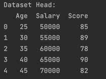

# GitHub Actions Matrix Build for Multiple Python Versions

## Goal

> Duke University IDS 706 Weekly Mini Project 4

- Set up a GitHub Actions workflow
- Test across at least 3 different Python versions

------------ Below is the old mini project ------------

------------ Below is the old mini project ------------

------------ Below is the old mini project ------------

This project is:
- Python script using Polars for descriptive statistics 
- Read a dataset (as above)
- Generate summary statistics (mean, median, standard deviation)
- Create one data visualization

## Preparation

1. make sure a data.csv file is in the same directory as main.py
2. Python 3 or above
3. Pandas
4. matplotlib.pyplot 
5. The dataset file is as follow:

## Run and Result

### Run
use
`python main.py`

Upon running the script, it will display the mean, median, and standard deviation of the dataset. Then, a bar chart showing the Salary distribution will be displayed using matplotlib.

### Result

To show correctly reading the dataset, I use the head() function to display the first 5 rows of the dataset

Further, I display the basic statistics of the dataset and three summary of statistics

For the data visualization, I plot the histogram of the `Salary` of the dataset:

### Test

use 
`make test` or `python test_main.py` to test the script

## Reference

1.  https://github.com/nogibjj/python-template